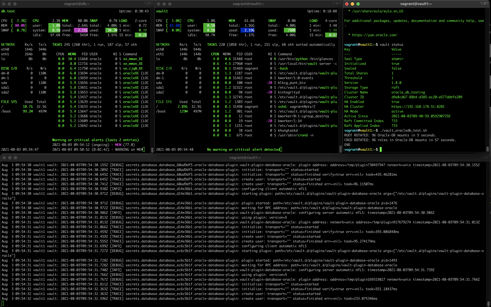

# HashiCorp `vagrant` demo of **`vault`** with Oracle-DB Secrets Engine.
This repo contains a `Vagrantfile` mock of a [Vault](https://www.vaultproject.io/) server setup with [Vault Database Secrets Engine](https://www.vaultproject.io/docs/secrets/databases/) enabled & configured to [Oracle DB](https://www.vaultproject.io/docs/secrets/databases/oracle).




## Makeup & Concept

```
                                .……………………………………….50
 Severs: Oracle & Vault         ┊   Oracle-DB   ┊
                                ┊    Database   ┊
                                └………………………………………┘
                                       ⤊
                                       ⤊
 other vault databases & roles ....____⤊______.51
 .┄┄┄┄┄┄┄┄┄┄┄┄┄┄┄┄┄┄┄┄┄┄┄┄┄┄┄.    |  vault1   |   .┄┄┄┄┄┄┄┄┄┄┄┄┄┄┄┄┄┄┄┄┄┄┄┄┄┄┄.
 |database4/rotate-root/oracle╲   |  oracle   |   |database1/rotate-root/oracle╲
 |database4/roles/my-role4    ┊╌╌╌|  plugins: |╌╌╌|database1/roles/my-role1    ┊
 ╰┄┄┄┄┄┄┄┄┄┄┄┄┄┄┄┄┄┄┄┄┄┄┄┄┄┄┄┄╯   |___________|   ╰┄┄┄┄┄┄┄┄┄┄┄┄┄┄┄┄┄┄┄┄┄┄┄┄┄┄┄┄╯
           .┄┄┄┄┄┄┄┄┄┄┄┄┄┄┄┄┄┄┄┄┄┄|┄┄┄!.   |┄┄|┄┄┄┄┄┄┄┄┄┄┄┄┄┄┄┄┄┄┄┄┄┄┄┄.
           |database3/rotate-root/oracle╲  |database2/rotate-root/oracle╲
           |database3/roles/my-role3    ┊  |database2/roles/my-role2    ┊
           ╰┄┄┄┄┄┄┄┄┄┄┄┄┄┄┄┄┄┄┄┄┄┄┄┄┄┄┄┄╯  ╰┄┄┄┄┄┄┄┄┄┄┄┄┄┄┄┄┄┄┄┄┄┄┄┄┄┄┄┄╯
```

### Prerequisites
Ensure that you already have the following hardware & software requirements:
 
##### HARDWARE
 - **RAM** **7**+ Gb Free at least (ensure you're not hitting SWAP either or are < 100Mb)
 - **CPU** **6**+ Cores Free at least (2 or more per instance better) 
 - **Network** interface allowing IP assignment and interconnection in VirtualBox bridged mode for all instances.

##### SOFTWARE
 - [**Virtualbox**](https://www.virtualbox.org/)
 - [**Vagrant**](https://www.vagrantup.com/)
 - [**Oracle DB XE 18c (18.4.0.0.00)**](https://www.oracle.com/database/technologies/xe-downloads.html)
 - **Few** **`shell`** or **`screen`** sessions to allow for multiple SSH sessions.


## Usage & Workflow
Refer to the contents of **`Vagrantfile`** for the number of instances, resources, Network, IP and provisioning steps. The variable `VPLUGIN_INSTANCES` specific the number of Vault database mounts to be configured and the same number of users are also created on the db.

The provided **`.sh`** script are installer helpers that download the latest vault binaries (or specific versions) and sets configurations for [Oracle DB Plugin](https://github.com/hashicorp/vault-plugin-database-oracle/).


```bash
# // in root of this repo:
wget https://download.oracle.com/otn-pub/otn_software/db-express/oracle-database-xe-18c-1.0-1.x86_64.rpm

vagrant up ;
# // ... output of provisioning steps.
vagrant global-status ; # should show running nodes
  # id       name    provider   state   directory
  # -------------------------------------------------------------------------------
  # 2a42e67  db         virtualbox running /home/auser/hashicorp.vagrant_vault_oracledb
  # 03a90a4  vault1     virtualbox running /home/auser/hashicorp.vagrant_vault_oracledb

# // SSH to vault1
vagrant ssh vault1 ;
# // ...
#vagrant@vault1:~$ \ # perform root-rotate on all Oracle-DB mounts & my-role
./vault_oracledb_test.sh
  # ROOT ROTATED: 96 Oracle-DB mounts in 9 seconds.
  # CRED ROTATED: 96 roles in Oracle-DB mounts in 84 seconds.
  # END
#// connecting to database:
sqlplus system/password@//db.test:1521/XEPDB1

# // SSH to db:
vault ssh db
# // ...
#vagrant@db:~$ \ # 
sudo su - oracle
. oraenv
XE
export ORACLE_PDB_SID=XEPDB1
sqlplus / as sysdba

# // ---------------------------------------------------------------------------
# when completely done:
vagrant destroy -f ; # ... destroy al
vagrant box remove -f oraclelinux/7 --provider virtualbox ; # ... delete box images
```


## Notes
This repo is intended as a mere practise / training exercise.

See also more information at:
 - [HTTP API Docs: Oracle Database Plugin](https://www.vaultproject.io/api-docs/secret/databases/oracle)
 - [Learn: rotation](https://learn.hashicorp.com/vault/secrets-management/db-root-rotation)
 - [Learn: Database Static Roles and Credential Rotation](https://learn.hashicorp.com/vault/secrets-management/db-creds-rotation)
 - [Learn: Dynamic Secrets: Database Secrets Engine](https://learn.hashicorp.com/tutorials/vault/database-secrets)

Reference material used:
 - [kikitux/vault-dev-orcl](https://github.com/kikitux/vault-dev-orcl)
------
